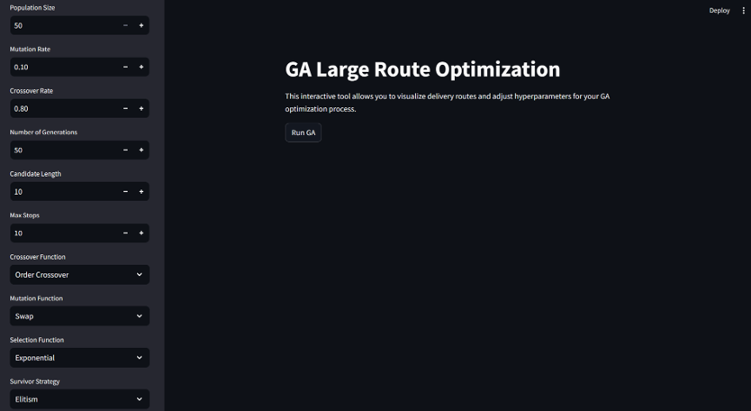

# Large Route Optimization using Genetic Algorithm

A project aimed at optimizing delivery routes for multiple trucks using a Genetic Algorithm (GA), minimizing overall costs while adhering to constraints like deadlines, truck capacities, and shortest paths.

## Features
- **Multi-Objective Optimization**: Minimizes delivery cost, distance, and ensures timely deliveries.
- **Dynamic Constraints**: Handles truck weight/size limits, order deadlines, and route distances.
- **Flexible Algorithm**: Implements crossover, mutation, and selection functions (e.g., Edge Crossover, Tournament Selection).
- **Interactive UI**: Visualizes routes, adjusts hyperparameters, and tracks fitness across generations.

## Datasets
### Orders
| Order_ID | Source | Destination | Deadline | Weight (kg) | Area (m²) |
|----------|--------|-------------|----------|-------------|-----------|
| A140109  | City_61| City_5      | 2022-04-11 | 3092       | 3.888     |

### Trucks
| Length (m) | Capacity (kg) | Cost/KM | Speed (km/h) |
|------------|----------------|---------|--------------|
| 16.5       | 10000          | 3       | 40           |

### Distances
| Source   | Destination | Distance (m) |
|----------|-------------|--------------|
| City_24  | City_47     | 1,114,251    |

## Algorithm Steps
1. **Preprocessing**: Extract relevant data (e.g., deadlines, capacities).
2. **Representation**: Chromosomes encode orders as unique lists.
3. **Fitness Function**: Weighted sum of constraints (lower = better).
4. **Initialization**: Random population generation.
5. **Crossover/Mutation**: Edge Crossover, Inversion Mutation.
6. **Selection**: Tournament or Rank-Based methods.
7. **Survivor Mechanism**: Elitism (top 30 individuals retained).
8. **Iteration**: Runs for user-defined generations.

## Results
- **Order Crossover** outperformed Edge Crossover by 0.6 seconds.
- **Random Resetting Mutation** enhanced population diversity.
- **Exponential Rank-Based Selection** achieved smoother convergence than Tournament Selection.

## Usage
1. Clone the repository.
2. Run `main.py` to launch the GUI.
3. Adjust hyperparameters (population size, mutation rate).
4. Visualize routes and track fitness metrics.

## UI Preview

- **Graphic Interface**: Adjust parameters (A/B/C/D toggles).
- **Fitness Tracking**: Monitor average fitness per generation.
- **Best Solution**: Displays optimal order assignments and fitness score.

## References
- Research papers on GA-based vehicle routing (see `Papers` section in project PDF).
